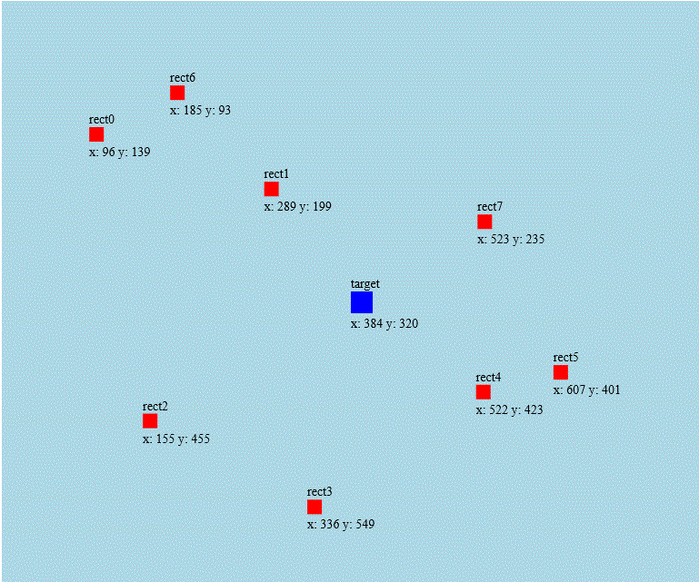

# Move towards point

Demonstration on how objects can move towards certain target. This example is implemented on html5 canvas but same principles apply to anything. Math is in MovingObject.getVelocity() -function.

